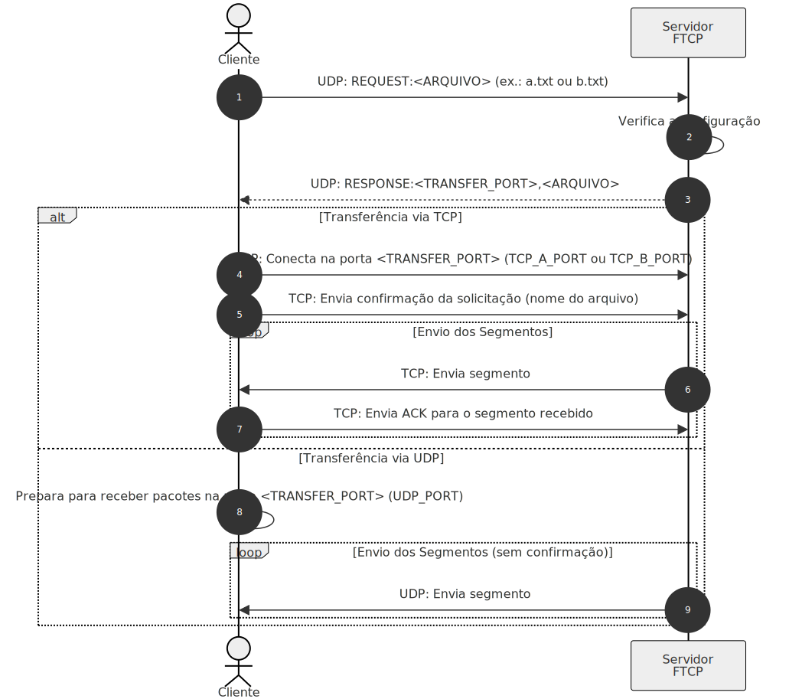
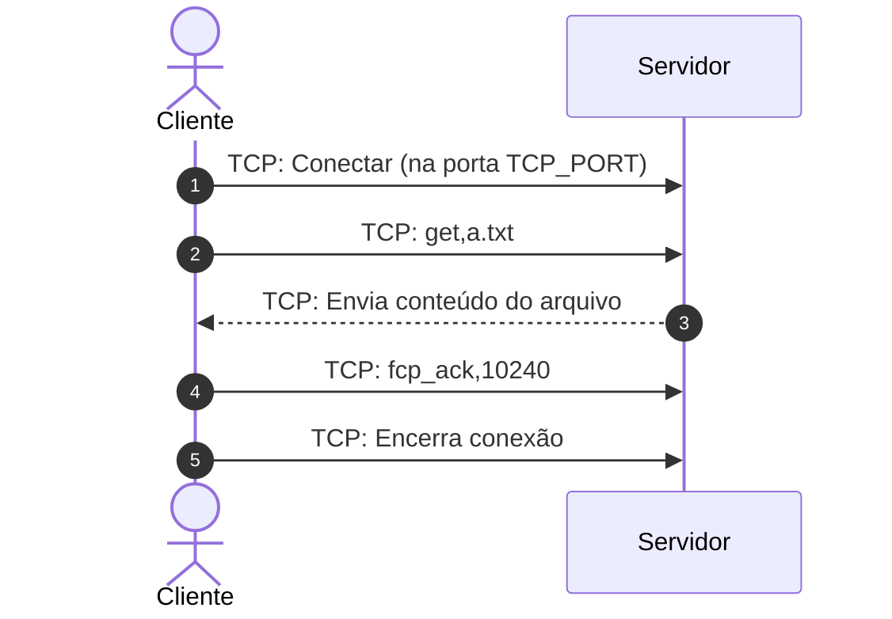

# Protocolo de Transferência de Arquivos Personalizado – FTCP (File Transfer Custom Protocol)

O objetivo desse projeto e desenvolver um **servidor de transferência de arquivos** que implemente os protocolos de transporte (TCP e UDP) internamente, mas opere com apenas uma delas por vez – conforme definido num arquivo de configuração. A transferência do arquivo será iniciada por meio de uma negociação via UDP, onde o cliente solicita um dos arquivos disponíveis (a.txt ou b.txt) e informa qual protocolo deseja utilizar. 

Os alunos deverão **implementar o servidor e o cliente** seguindo o protocolo especificado. 

## Descrição do protocolo FTCP

O fluxo de operação é dividido em duas etapas principais. 
O diagrama ilustra, em alto nível, o fluxo de comunicação entre o cliente e o servidor durante a transferência de um arquivo utilizando o protocolo proposto. 



Na [primeira etapa](#etapa-1--negociação-inicial-via-udp), a negociação é realizada via UDP: o cliente envia uma mensagem UDP para a porta de negociação do servidor solicitando um arquivo (por exemplo, "REQUEST,TCP,a.txt" ou "REQUEST,TCP,b.txt"). O servidor, ao receber essa solicitação, processa a informação, verifica a existência do arquivo e, então, responde utilizando UDP, informando qual protocolo de transferência será utilizado (TCP ou UDP) e especificando a porta de transferência adequada para o arquivo solicitado.

Na [segunda etapa](#etapa-2--transferência-do-arquivo), ocorre a transferência dos dados. Se a transferência for via UDP, o servidor envia os segmentos do arquivo diretamente para o cliente na porta indicada, sem estabelecer uma conexão prévia; cada segmento pode incluir um cabeçalho com um número de sequência para controle. 

Por outro lado, se a transferência for via TCP, o cliente abre uma conexão TCP com o servidor utilizando a porta definida na negociação. Após o estabelecimento da conexão, o servidor envia os dados em segmentos numerados, e o cliente confirma o recebimento de cada segmento por meio de mensagens de ACK, garantindo, assim, uma transferência de dados confiável.

A seguir segue o detalhe das etapas.

### Etapa 1 – Negociação Inicial via UDP

1. **Solicitação do Cliente:**  
   O cliente envia uma mensagem UDP para a porta de negociação do servidor (configurada via parâmetro UDP_NEGOTIATION_PORT) com a seguinte estrutura:  
      
    ```
    <COMANDO>,<PROTOCOLO>,<ARQUIVO>
    ```
    Onde:
    - `<COMANDO>` o unico comando dessa etapa e o `REQUEST`, que requisita o a porta para transmissão.
    - `<PROTOCOLO>` indica a preferência ("TCP") caso o cliente solicite com UDP, o servidor deve retornar um erro (descrito na secao abaixo)
    - `<ARQUIVO>` pode ser "a.txt" ou "b.txt".
    - `<DEST_PORT>` (incluso apenas na solicitação UDP) é a porta na qual o cliente deseja receber os dados.
    
    - Desse modo para solicitar o arquivo `a.txt` o cliente envia o string, para o servidor
      ```
      REQUEST,TCP,a.txt
      ```
    <!-- - Se o cliente deseja UDP:  
      ```
      REQUEST:UDP,<ARQUIVO>,<DEST_PORT>
      ``` -->
    

2. **Resposta do Servidor:**
   Ao receber a solicitação, o servidor processa a informação, verifica a existência do arquivo solicitado (considerando os caminhos definidos no arquivo de configuração) e responde via UDP com a mensagem
   
    ```
    <COMANDO>,<PROTOCOLO>,<TRANSFER_PORT>,<ARQUIVO>
    ```
   
   Onde:
   
    - `<COMANDO>` o unico comando dessa etapa e o `REQUEST`, que requisita o a porta para transmissão.
      - `ERROR` caso o arquivo não exista ou o cliente solicite a tranferencia em um protocolo diferente do `TCP`
        - Nesse caso a resposta sera vazia para o `<TRANSFER_PORT>,<ARQUIVO>` (e.g.,`ERROR,PROTOCOLO INVALIDO,,`)
      - `RESPONSE` caso o protocolo (TCP) e o arquivo seja valido o servidor informa a porta TCP para o cliente solicitar o arquivo.
    - `<PROTOCOLO>` ecoa a preferência informada pelo cliente (TCP).
    - `<TRANSFER_PORT>` é determinado da seguinte forma:
      - Se o protocolo for **TCP**, esse campo contém a porta fixa configurada no servidor para transferência via TCP.
    - `<ARQUIVO>` indica novamente o arquivo solicitado.

    Exemplos,

    Solicitação correta
    ```mermaid
    %%{init: { 'logLevel': 'debug', 'theme': 'neutral' } }%%

    sequenceDiagram
        autonumber
        actor C as Cliente
        participant S as Servidor <br/> FTCP

        %% Etapa 1 – Negociação Inicial via UDP
        C->>S:  UDP: REQUEST,TCP,a.txt
        S-->>C: UDP: RESPONSE,TCP,5001,a.txt
    ```

    Solicitação invalida
    ```mermaid
    %%{init: { 'logLevel': 'debug', 'theme': 'neutral' } }%%

    sequenceDiagram
        autonumber
        actor C as Cliente
        participant S as Servidor <br/> FTCP

        %% Etapa 1 – Negociação Inicial via UDP
        C->>S:  UDP: REQUEST,UDP,a.txt
        S-->>C: UDP: ERROR,PROTOCOLO INVALIDO,,
    ```

Após essa etapa o cliente solicitará a transferência de dados([Etapa 2](#etapa-2--transferência-dos-dados)). 

### Etapa 2 – Transferência dos Dados
Após a negociação, o cliente utiliza o protocolo e a porta determinados para efetuar a transferência e receber o arquivo:

1. **Estabelecimento de Conexão:**  
  O cliente abre uma conexão TCP com o servidor utilizando a porta fixa indicada na resposta (por exemplo, TCP_PORT definido na configuração).

2. **Solicitação do Arquivo:**  
  Após estabelecer a conexão, o cliente envia o comando para solicitar o arquivo:
  
      get,arquivo
  
    Por exemplo:
    
        get,a.txt

3. **Envio dos Dados:**  
  O servidor, ao receber o comando, lê o conteúdo do arquivo solicitado e envia os dados através da conexão TCP.  
  A transferência dos dados pode ser realizada de forma contínua ou em segmentos, conforme a implementação.

- **Confirmação pelo Cliente (ACK):**  Assim que o cliente recebe todo o arquivo, ele identifica o total de bytes recebidos e envia uma mensagem de confirmação para o servidor:
  
      ftcp_ack,numero_de_bytes
  
  Por exemplo, para um arquivo com 10240 bytes:
  
      ftcp_ack,10240

4. **Encerramento da Conexão:**  Após enviar a confirmação, o cliente encerra a conexão TCP.

#### Diagrama da trânsferencia 

O diagrama abaixo ilistra o funcionamento desse protocolo.



## Sobre o servidor 

O servidor utiliza um arquivo de configuração (`config.ini`), localizado na mesma pasta do script, com os seguintes parâmetros:

<!-- - **TRANSFER_PROTOCOL:** Define a stack de transferência a ser utilizada por padrão (o servidor validará o pedido do cliente e poderá seguir a preferência informada).   -->
- **TCP_PORT:** Porta fixa para transferência via TCP.  
- **UDP_PORT:** Porta para negociação via UDP.  
- **FILE_A:** Caminho para o arquivo a.txt.  
- **FILE_B:** Caminho para o arquivo b.txt.  
<!-- - **WINDOW_SIZE:** (apenas para TCP) Tamanho da janela de transmissão para o mecanismo de controle, que define quantos segmentos podem ser enviados antes de aguardar confirmações. -->

Um exemplo de conteúdo do arquivo pode ser:

```ini
[SERVER_CONFIG]
TCP_PORT = 5001
UDP_PORT = 5002
FILE_A = a.txt
FILE_B = b.txt
```

Cada grupo poderá editar o conteúdo de `a.txt` ou `b.txt` para personalizar a mensagem em ASCII que será transferida. Esse arquivos personalizados devem estar no repositorio do grupo. Onde o arquivo `a.txt` deve conter uma frase curta e o arquivo `b.txt` deve ter entre 4KB e 10KB.

## Dicas de desenvolvimento

- **Códificação dos dados e comandos**
  - Utilize sempre a codificação a mesma códificação (e.g., UTF-8 )para os seus arquivos e comandos. 
    - Isso evita problemas com acentuação e caracteres especiais.
  - Comente seu código de forma clara e objetiva para facilitar a manutenção e a compreensão por parte de outros desenvolvedores.
  - Faça o tratamento adequado de exceções para garantir que erros inesperados sejam devidamente capturados e tratados.
- **Escutar duas portas simultaneamente(Negociação e Transferência)**
  - Considere utilizar threads ou processos separados para que o servidor possa escutar simultaneamente na porta de negociação (UDP) e na porta de transferência (TCP).  
<!-- - Em linguagens que suportam programação assíncrona, avalie o uso de bibliotecas como select, poll ou frameworks de I/O assíncrono (por exemplo, asyncio no Python) para gerenciar múltiplas conexões de forma não bloqueante. -->
  - Garanta que o tratamento de clientes em cada porta seja feito de maneira isolada para evitar interferências entre os processos de negociação e de transferência.
  <!-- - Certifique-se de tratar corretamente o encerramento dos sockets para evitar vazamentos de recursos e problemas durante o shutdown do servidor.
   -->
- **Cuidados na Transferência de Arquivo**
  - Utilize métodos como o sendall (ou equivalentes em sua linguagem) para garantir que todos os bytes sejam enviados, evitando que dados fiquem presos em buffers.
  - Implemente timeouts e verifique periodicamente se a conexão permanece ativa, de forma a detectar travamentos ou interrupções inesperadas na transmissão.
  - **Extra**
    - Considere implementar um mecanismo de confirmação (ACK) para cada bloco ou porção significativa de dados, assegurando que o cliente recebeu corretamente o conteúdo transferido, e facilitando a retomada ou retransmissão em caso de perda de pacotes.
    - Evite enviar arquivos inteiros em uma única operação. Quebre o arquivo em segmentos de tamanho gerenciável, o que pode ajudar a reduzir a saturação da conexão e facilitar a detecção de problemas durante a transferência.


### Servidor exemplo

A seguir temos um exemplo em python de um servidor `echo`, repete no console e para o cliente o que recebe via rede. 

```python
import socket
import threading

def udp_echo():
    udp_sock = socket.socket(socket.AF_INET, socket.SOCK_DGRAM)
    udp_sock.bind(('0.0.0.0', 5698))
    print("UDP server listening on port 5698")
    while True:
        data, addr = udp_sock.recvfrom(1024)
        if not data:
            continue
        print(f"UDP Received from {addr}: {data.decode('utf-8')}")
        udp_sock.sendto(data, addr)

def handle_tcp_client(conn, addr):
    print(f"TCP Client connected from {addr}")
    with conn:
        while True:
            data = conn.recv(1024)
            if not data:
                break
            print(f"TCP Received from {addr}: {data.decode('utf-8')}")
            conn.sendall(data)
    print(f"TCP Client disconnected from {addr}")

def tcp_echo():
    tcp_sock = socket.socket(socket.AF_INET, socket.SOCK_STREAM)
    tcp_sock.setsockopt(socket.SOL_SOCKET, socket.SO_REUSEADDR, 1)
    tcp_sock.bind(('0.0.0.0', 6000))
    tcp_sock.listen(5)
    print("TCP server listening on port 6000")
    while True:
        conn, addr = tcp_sock.accept()
        client_thread = threading.Thread(target=handle_tcp_client, args=(conn, addr))
        client_thread.daemon = True
        client_thread.start()

if __name__ == '__main__':
    # thread UDP
    udp_thread = threading.Thread(target=udp_echo)
    udp_thread.daemon = True
    udp_thread.start()

    # thread TCP
    tcp_thread = threading.Thread(target=tcp_echo)
    tcp_thread.daemon = True
    tcp_thread.start()

    print("Tudo ok. Ctrl+C para encerrar.")

    try:
        while True:
            pass
    except KeyboardInterrupt:
        print("Servidor encerrado.")
```


Código do [echo_server.py](./echo_server.py) que pode ser utilizado como base para o seu servidor.

### Como testar o código

Execute o [echo_server.py](./echo_server.py) 

```bash
python echo_server.py
```

Em sua máquina utilize os comando abaixo para ver o servidor em funcionamento.

#### Testando o servidor TCP com Telnet

1. Abra o terminal.
2. Conecte-se ao servidor via Telnet:
   
       telnet localhost 6000

3. Digite uma mensagem e pressione Enter. O servidor deverá enviar de volta (echo) a mesma mensagem.

#### Testando o servidor UDP com Netcat

1. Abra o terminal.
2. Envie dados via UDP usando o Netcat (nc). Por exemplo:
```bash
  echo "Olá UDP" | nc -u localhost 5698
```
3. Para receber o echo, você pode iniciar o Netcat em modo escuta em outra janela do terminal:
```bash
  nc -u -l 5698
```
Em seguida, envie a mensagem de outro terminal, conforme mostrado no passo 2.

