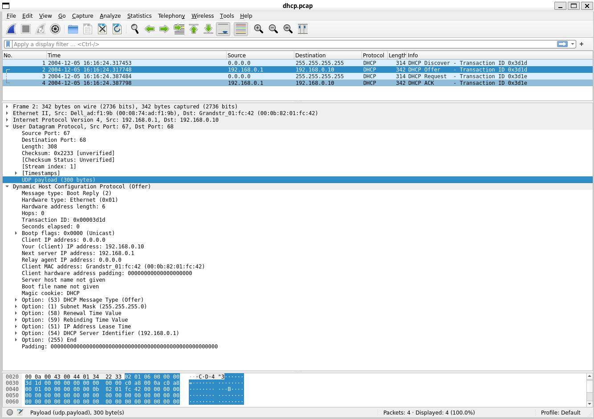
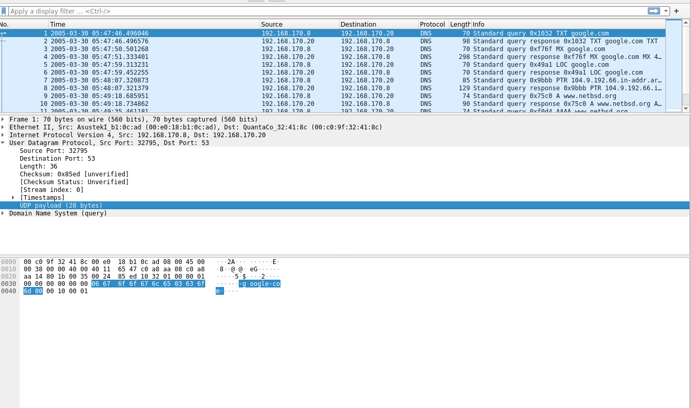

# Relatório de Análise de Tráfego de Rede com Wireshark

Este documento descreve como instalar o Wireshark e, principalmente, **como utilizá-lo para analisar um arquivo de captura de tráfego (`.pcap`)**. 

## 1. Instalação do Wireshark

Para analisar o arquivo de captura, você precisará do Wireshark instalado em seu computador. O Tshark (linha de comando) não é estritamente necessário para esta análise baseada na interface gráfica, mas é instalado junto.

### 1.1. Windows

1.  **Download:** Acesse o site oficial [www.wireshark.org](https://www.wireshark.org/) e baixe o instalador para Windows.
2.  **Instalação:** Execute o instalador. Siga as instruções, garantindo que o **Npcap** (driver de captura, necessário mesmo que não vá capturar agora) seja instalado quando solicitado.

### 1.2. Linux (Debian/Ubuntu)

1.  **Abra o Terminal.**
2.  **Atualize os Pacotes:**
    ```bash
    sudo apt update
    ```
3.  **Instale o Wireshark:**
    ```bash
    sudo apt install wireshark
    ```
4.  **Permissões (Opcional, mas recomendado para futuras capturas):** Durante a instalação, se perguntado se usuários não-root devem poder capturar pacotes, selecione **"Sim"**. Adicione seu usuário ao grupo `wireshark`:
    ```bash
    sudo usermod -aG wireshark $USER
    ```
    Lembre-se de fazer **logout e login novamente** para a mudança de grupo ter efeito.

---


## 2. Captura de Tráfego do Projeto FTCP

Agora, capture o tráfego gerado especificamente pela execução do seu cliente e servidor FTCP.

> **⚠️ ATENÇÃO:** Arquivos de captura (`.pcap`, `.pcapng`) podem conter dados sensíveis. Manuseie-os com cuidado, armazene-os de forma segura e descarte-os adequadamente após a análise. Não compartilhe capturas brutas publicamente se houver risco de exposição de dados.

**Passos:**

1.  **Identifique a Interface Correta:** Antes de capturar, descubra qual interface de rede será usada para a comunicação entre seu cliente e servidor.
    *   Se cliente e servidor rodam na **mesma máquina**, a interface provavelmente será a de **Loopback** (nome pode variar: `lo`, `lo0`, `Loopback Pseudo-Interface 1`).
    *   Se rodam em **máquinas diferentes** na mesma rede local, será sua interface de rede principal (Wi-Fi ou Ethernet).
    *   Use o comando `tshark -D` (ou veja na tela inicial do Wireshark) para listar as interfaces e seus números/nomes.
    ```bash
    # Exemplo no Linux
    tshark -D

    # Exemplo no Windows (Prompt ou PowerShell)
    tshark -D
    ```

2.  **Inicie a Captura (usando Tshark):** Abra um terminal ou prompt de comando (pode precisar de `sudo` no Linux ou "Executar como Administrador" no Windows para capturar em interfaces reais, mas geralmente não para loopback).
    ```bash
    # Exemplo Captura (substitua <interface> pelo nome ou número correto)
    # Salvar no arquivo 'ftcp_capture.pcapng'
    sudo tshark -i <interface> -w ftcp_capture.pcapng
    ```
    *   **Alternativa:** Você pode usar a interface gráfica do Wireshark. Selecione a interface correta e clique no botão azul de "Start" (barbatana de tubarão).

3.  **Execute o Cenário FTCP:**
    *   Inicie seu **servidor FTCP**.
    *   Execute seu **cliente FTCP** para solicitar um arquivo (ex: `a.txt` via TCP).
    *   Espere a transferência ser concluída com sucesso.
    *   (Opcional, mas recomendado) Execute o cliente novamente para gerar um cenário de erro (ex: pedir protocolo UDP).

4.  **Pare a Captura:**
    *   Se estiver usando `tshark` no terminal, volte para ele e pressione `Ctrl + C`.
    *   Se estiver usando a interface gráfica do Wireshark, clique no botão vermelho "Stop".

5.  **Salve o Arquivo (se usando Wireshark GUI):** Se usou a interface gráfica, vá em `File -> Save As...` e salve a captura com um nome descritivo (ex: `ftcp_capture.pcap`). 

O arquivo `.pcap` gerado contém agora os pacotes trocados durante a execução do seu protocolo FTCP e está pronto para a análise detalhada na próxima seção.


## 3. Tutorial: Análise Básica com Wireshark (Usando o Arquivo Fornecido)

Nesta seção, vamos aprender os fundamentos do Wireshark analisando tráfegos DHCP e DNS presentes no arquivo de captura fornecido.

**Arquivo de Captura:** Baixe o arquivo `.pcap` necessário para esta análise disponiveis nesse repositorio, 
[pcap/exemplos](pcaps/exemplos/) 

**Passos Iniciais:**

1.  **Abra o Wireshark:** Inicie a aplicação Wireshark.
2.  **Abra o Arquivo de Captura:** Vá ao menu `File -> Open...` (ou `Arquivo -> Abrir...`) e selecione o arquivo `.pcap` que você baixou.
3.  **Interface Principal:** Familiarize-se com as três áreas principais da interface do Wireshark, conforme ilustrado na imagem abaixo:
    *   **A) Painel de Lista de Pacotes:** Mostra um resumo de cada pacote capturado (número, tempo, origem, destino, protocolo, informações básicas).
    *   **B) Painel de Detalhes do Pacote:** Exibe as informações decodificadas do pacote selecionado na lista, organizadas por camadas (Frame, Ethernet, IP, TCP/UDP, Protocolo de Aplicação). Você pode expandir/recolher cada camada clicando nas setas.
    *   **C) Painel de Bytes do Pacote:** Mostra o conteúdo bruto do pacote selecionado em hexadecimal e ASCII.

     


4.  **Filtros de Exibição:** A barra de filtro (geralmente acima do Painel de Lista de Pacotes) é uma das ferramentas mais poderosas. Ela permite que você mostre apenas os pacotes que correspondem a um critério específico (sem modificar o arquivo original). Digite sua expressão de filtro e pressione Enter para aplicá-la. Para limpar o filtro, clique no 'X' à direita da barra.

**Análise Guiada (DHCP e DNS):**

### 3.1 Análise DHCP (Obtenção de Endereço IP)

O protocolo DHCP (Dynamic Host Configuration Protocol) é usado para que um dispositivo obtenha automaticamente um endereço IP e outras configurações de rede.

1.  **Aplique o Filtro:** No campo de filtro de exibição, digite `bootp` e pressione Enter. (DHCP usa a mesma base do protocolo BOOTP, por isso este filtro funciona).
2.  **Observe os Pacotes:** Você deverá ver uma sequência de pacotes DHCP. As quatro mensagens principais são: **Discover**, **Offer**, **Request**, e **ACK** (ou Acknowledgment). Veja como eles aparecem na coluna "Info" do Painel de Lista de Pacotes.

   

3.  **Examine os Detalhes:**
    *   **Selecione** um pacote **DHCP Offer**. No Painel de Detalhes (B), expanda a seção "Bootstrap Protocol" ou "Dynamic Host Configuration Protocol". Procure por informações como o endereço IP oferecido ("Your (client) IP address" ou opções específicas).
    *   **Selecione** um pacote **DHCP ACK**. Examine os detalhes da mesma forma. Confirme o endereço IP final atribuído e outras opções (como máscara de sub-rede, gateway, servidor DNS) se estiverem presentes.
    *   Note as portas UDP usadas (geralmente 67 para o servidor e 68 para o cliente) na seção "User Datagram Protocol".

### 3.2 Análise DNS (Resolução de Nomes)

O protocolo DNS (Domain Name System) é usado para traduzir nomes de domínio legíveis por humanos (como `www.google.com`) em endereços IP compreensíveis por máquinas.

1.  **Limpe o Filtro Anterior:** Clique no 'X' na barra de filtro.
2.  **Aplique o Filtro:** Digite `dns` na barra de filtro e pressione Enter.
3.  **Observe os Pacotes:** Você verá pares de pacotes: uma consulta ("Standard query") e uma resposta ("Standard query response").

   

4.  **Examine os Detalhes:**
    *   **Selecione** um pacote de **Standard query** (por exemplo, para `www.google.com`, se houver no arquivo). No Painel de Detalhes (B), expanda a seção "Domain Name System" e depois "Queries". Observe o nome sendo consultado e o tipo de registro solicitado (geralmente A para IPv4 ou AAAA para IPv6).
    *   **Selecione** o pacote de **Standard query response** correspondente. No Painel de Detalhes, expanda a seção "Domain Name System" e depois "Answers". Observe o nome, o tipo de registro retornado, e o(s) endereço(s) IP correspondente(s).
    *   Note a porta UDP (geralmente 53) na seção "User Datagram Protocol".

---

## 4. Dicas para análise do protocolo FTCP

Agora, utilizando as habilidades adquiridas, vamos analisar o tráfego do protocolo **FTCP** presente no **mesmo arquivo `.pcap` fornecido**. O objetivo é verificar se a comunicação entre cliente e servidor segue as especificações do protocolo FTCP.

**Instruções:** Use filtros de exibição e a análise dos detalhes dos pacotes para investigar as duas etapas do protocolo FTCP.

### 4.1. Etapa 1: Negociação Inicial via UDP

*   **Filtros Sugeridos:**
    *   `udp.port == <PORTA_UDP_NEGOCIACAO>` (Substitua `<PORTA_UDP_NEGOCIACAO>` pelo número da porta de negociação usada no `config.ini` do servidor, ex: `udp.port == 5002`).
    *   Você pode refinar mais, por exemplo: `udp.port == <PORTA_UDP_NEGOCIACAO> && frame contains "REQUEST"`
*   **Análise:**
    *   Identifique o pacote UDP do **cliente para o servidor** contendo a mensagem `REQUEST,<PROTOCOLO>,<ARQUIVO>`. Verifique o payload no Painel de Detalhes ou Bytes.
    *   Identifique o pacote UDP de **resposta do servidor para o cliente**.
        *   Se for um `RESPONSE,TCP,<TRANSFER_PORT>,<ARQUIVO>`, confirme se a porta `<TRANSFER_PORT>` corresponde à configurada para TCP.
        *   Se for um `ERROR,...`, verifique a mensagem de erro.
    *   **(Ação do Aluno):** Tire um screenshot mostrando o pacote de `REQUEST` e o pacote de `RESPONSE` (ou `ERROR`) filtrados. Destaque o payload de aplicação dentro da camada UDP nos detalhes do pacote.

### 4.2. Etapa 2: Transferência dos Dados via TCP

*   **Objetivo:** Verificar o estabelecimento da conexão TCP, a troca de comandos `get` e `ftcp_ack`, e a transferência do arquivo.
*   **Filtros Sugeridos:**
    *   `tcp.port == <PORTA_TCP_TRANSFERENCIA>` (Substitua `<PORTA_TCP_TRANSFERENCIA>` pela porta TCP informada na Etapa 1, ex: `tcp.port == 5001`).
    *   Para ver comandos específicos: `tcp.port == <PORTA_TCP_TRANSFERENCIA> && frame contains "get,"` ou `tcp.port == <PORTA_TCP_TRANSFERENCIA> && frame contains "ftcp_ack,"`
*   **Análise:**
    *   **Handshake TCP:** Identifique os três pacotes iniciais (SYN, SYN-ACK, ACK) que estabelecem a conexão na porta TCP correta. Use o filtro `tcp.flags.syn == 1` combinado com o filtro de porta para ajudar.
    *   **Comando `get`:** Encontre o pacote TCP enviado pelo cliente contendo o comando `get,<ARQUIVO>`. Verifique o payload.
    *   **Transferência de Dados:** Observe os pacotes TCP subsequentes enviados **pelo servidor para o cliente**. Veja o conteúdo do arquivo sendo transmitido no payload desses pacotes. Observe os números de sequência e confirmação (Sequence/Acknowledgment numbers) no cabeçalho TCP.
    *   **Comando `ftcp_ack`:** Encontre o pacote TCP enviado pelo cliente (após receber os dados) contendo `ftcp_ack,<numero_de_bytes>`. Verifique se o número de bytes corresponde ao esperado.
    *   **Encerramento TCP:** Identifique os pacotes com as flags FIN/ACK trocados para finalizar a conexão. Use filtros como `tcp.flags.fin == 1`.
    *   **(Ação do Aluno):**
        *   Tire um screenshot mostrando os pacotes do handshake TCP.
        *   Tire um screenshot mostrando o pacote com o comando `get`.
        *   Tire um screenshot mostrando alguns pacotes com dados do arquivo sendo enviados pelo servidor.
        *   Tire um screenshot mostrando o pacote com o comando `ftcp_ack`. Descreva brevemente como os números de sequência/ACK do TCP garantem a entrega confiável vista nesses pacotes.

---

## 5. Materiais de Apoio Adicionais

Para aprofundar seus conhecimentos em Wireshark:

*   **Guia Oficial do Usuário:** [Wireshark User's Guide](https://www.wireshark.org/docs/wsug_html_chunked/)
*   **Wiki do Wireshark (Filtros):** [wiki.wireshark.org/DisplayFilters](https://wiki.wireshark.org/DisplayFilters)
*   **Vídeos Tutoriais:** Busque no YouTube por "Wireshark tutorial", "Wireshark display filters", "Wireshark TCP analysis".
    *  [Tutorial Wireshark para Iniciantes (YouTube)](https://www.youtube.com/watch?v=4rQ3evV600Y)
